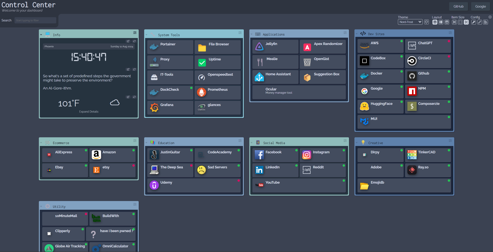

# zfserver

A guide to how I setup my home-lab server

## Hardware/Software Used

Hardware:

- [Mini PC](https://www.amazon.com/gp/product/B0CJBT1K5D/ref=ppx_yo_dt_b_search_asin_title?ie=UTF8&th=1)
- [External Hard Drive](https://www.amazon.com/Passport-Portable-External-Drive-Black/dp/B07VTFN6HM/ref=sr_1_11?crid=2Z6NUQE038RZK&dib=eyJ2IjoiMSJ9.qehNdfA5qYjuOHOANCWs0YyB9lEAl1EyxmublonHZ3ucBcZVq_KtHl72bA8NKbcNsEGoTNned-RJYG7Z6H0-uE1kGjHqzCQ0F8Xx-Xg9PGOxgyGNxKt0gkz_oj_c9yAS-kburQJWNMQOJtxFQ78paMEFQQuGoSjpXF_ajQgAGXf-Cj7L84qJrKMiyfXkzScpuzaHp6ROaGV5TaWUxexKT6opfBosx37pDyxp5k37r9KsGm5MSaYk2YboW7iBNAUcT9rQenH3L2veP5Bu69sU7UxKytn7MmzP9PD6PtPXi4U.V_oZ2G9q96eiddAGnuDfXctnqFMJOIhU-FfusICRYQY&dib_tag=se&keywords=wd+mypassport+ultra+1.5&qid=1723413368&s=electronics&sprefix=wd+mypassport+ultra+1.5%2Celectronics%2C136&sr=1-11)

Goal here is a computer with at least 8gb of memory and a decent processor. I went with a mini pc because it's small and doesn't take up much space. I also went with an external hard drive because I wanted to be able to easily move my data around if needed which I did when I went from an raspberry pi to the mini pc when the pi couldn't handle the containers I was running.

Upgrades here can include a stronger pc and a better external hard drive system including a NAS system or a RAID setup. For my purposes, I just wanted a simple (and affordable) setup to start.

Software (For Hardware/Home-lab Development):

- [Ubuntu](https://ubuntu.com/download/desktop)
- [Docker](https://docs.docker.com/engine/install/ubuntu/)
- [Docker Compose](https://docs.docker.com/compose/install/)
- [VS Code](https://code.visualstudio.com/)
- [Git](https://git-scm.com/book/en/v2/Getting-Started-Installing-Git)
- [Vim](https://www.vim.org/download.php)
- [Bash] (<https://www.gnu.org/software/bash/>)

Ubuntu is my OS of choice since Linux is much easier to work with compared to Windows and MacOS (also cheaper as well). Docker is used to run all applications on the sever as containers and Docker-Compose makes it easier to manage containers with simple commands. VS Code is, in my humble opinion, the best code editor out there and I use it mostly for a SSH connection to the server for managing files along with editing compose files as needed. Git is used for version control and pulling repos as need be (along with personal development projects). Vim is used for quick edits when need be and Bash is used for scripting and automation to help make setting up new services easy but also to help with maintenance as well. 

## Containers Used



- [Portainer](https://www.portainer.io/) - Container Management in a web interface
- [Dashy](https://github.com/lissy93/dashy) - Dashboard for monitoring containers
- [Apex Web Randomizer] - Custom made program for a Apex Legends challenge with friends
- [Dockcheck Web] [	palleri/dockcheck-web:latest] - Web interface for Dockcheck to check if containers can be updated
- [Filebrowser](https://filebrowser.org/) - File manager for the server
- [glances](https://nicolargo.github.io/glances/) - System monitoring tool
- [grafana](https://grafana.com/) - Dashboard for monitoring containers
- [home-assistant](https://www.home-assistant.io/) - Home automation software
- [it-tools](https://hub.docker.com/r/corentinth/it-tools) - Tools to make IT easy
- [Jellyfin](https://jellyfin.org/) - Media Server for Movies, Music, and TV Shows
- [Jenkins](https://www.jenkins.io/) - Automation server
- [mealie](https://mealie.io/) - Recipe manager
- [npm](https://github.com/NginxProxyManager/nginx-proxy-manager) - Node Package Manager
- [Ocular](https://github.com/simonwep/ocular) - Web based budget tool
- [openspeedtest](https://hub.docker.com/r/openspeedtest/latest) - Speed test tool
- [Prometheus](https://prometheus.io/) - Monitoring tool
= [Suggestions] - Custom made program for testing a full stack suggestions box application in containers
- [uptime-kuma](https://github.com/louislam/uptime-kuma) - Uptime monitoring tool
- [Watchtower](https://containrrr.dev/watchtower/) - Automatic container updates

Most containers found here: [Awesome-SelfHosted](https://github.com/awesome-selfhosted/awesome-selfhosted) or via Google searches for specific needs.

## Setting Up the Server

1. Install Ubuntu
2. Install Docker/Docker-Compose
3. Setup SSH connection to server
4. Setup Docker-Compose files for services

### Install Ubuntu

1. Download Ubuntu from the link above
2. Create a bootable USB with Ubuntu
3. Boot into the USB and install Ubuntu (I used a monitor and keyboard for this part, I also hardwired the pc to ethernet to make sure the install went smoothly and not because the WIFI chip got disabled by removing Windows)
4. Follow the prompts and install Ubuntu, be sure to remember your password and username, those will be important for the SSH connection
5. Also run ifconfig in a terminal to get the IP address of the server, this will be important for the SSH connection as well

```bash
ifconfig
```

### Setup Docker/Docker-Compose

Follow the instructions in the links above to install Docker and Docker-Compose. 

### Setup SSH Connection to Server

1. Run the following command to generate a SSH key on your local machine

```bash
ssh-keygen
```

2. Run the following command to copy the SSH key to the server

```bash
ssh-copy-id username@ip_address
```

3. Run the following command to SSH into the server

```bash
ssh username@ip_address
```

### Setup Docker-Compose Files for Services

This is where more of my touch on the whole build begins. I will divide this section into the following: 

1. Setting up the external hard drive for services to use
2. Setting up a Projects folder and some automation scripts/tools
3. Setting up the Docker-Compose files for the services and getting them running
4. Handling the connection to the server via hostnames

#### Setting up the External Hard Drive (How I did it)

1. Plug in the external hard drive to the server

2. Run the following command to identify the drive

```bash
sudo lsblk
```

Also, run the following command to get the UUID of the drive (using the information from the lsblk command)

```bash
sudo blkid
```

3. Copy the UUID of the drive and run the following command to create a mount point for the drive

```bash
sudo mkdir /mnt/external
```

4. Run the following command to mount the drive to the mount point

```bash
sudo mount /dev/sdb1 /mnt/external
```
The /dev/sda1 may be different depending on what step 2 gave you.

5. Run the following command to make the drive mount on boot

```bash
sudo vim /etc/fstab
```

Add the following line to the file

```
UUID=YOUR_UUID /mnt/external ext4 defaults 0 0
```

6. Run the following command to make sure the drive is mounted

```bash
sudo mount -a
```

#### Setting up a Projects Folder and Automation Scripts/Tools Folder

1. I created a Projects folder on /home/username/Projects to store all the containers that would be ran. I also made a scripts folder in the /home/username directory to store all the automation scripts/tools I would be using. Some of these files will be available in the repo.

```bash
mkdir /home/username/Projects
mkdir /home/username/Scripts
```

2. For any Scripts, I made sure to do the following to be sure they can execute

```bash
chmod +x script.sh
```

And with that, I made the following scripts:

- dockerStart.py - Goes into each directory in Projects and starts the containers
- makeNewService.sh --name $ : Creates a new service with the name given by generating a new directory in Projects and building the necessary files (docker-compose.yml, service.sh, etc.)

For crontab, I made the following entry with the root user:

```bash
PATH=/bin:/sbin:/usr/bin:/usr/sbin
@reboot /usr/bin/env python3 /home/zfranke/Scripts/dockerStart.py >> /home/zfranke/Scripts/log.txt 2>&1
```

This guarantees that all the containers will start on boot using the dockerStart.py script. In the regular user crontab, I made the following entry:

```bash
0 3 15 * * /sbin/reboot
```

This reboots the server on the 15th of every month at 3am to make sure the server is up to date and running smoothly. Helps with any memory leaks or other issues that may arise.

#### Setting up the Docker-Compose Files for the Services and Getting Them Running

1. In the projects directory, each service that I want to run has its own folder with the following: 

- docker-compose.yml 
- (service).sh
- support files/config files as needed

2. The compose files all run on the same network to make sure they can communicate with each other. I also made sure to use the external hard drive for any volumes that needed to be persistent.

Before building any services, I made sure to run the following command to create the network:

```bash
docker network create zf-network
```

3. With the network made and the hard drive mounted, I can then make the compose files for each service reflect these changes. An example compose file is the filebrowser

```yaml
version: '3'
services:
  file:
    image: filebrowser/filebrowser
    ports:
      - "1776:80"
    volumes:
      - /mnt/external:/srv
      - /mnt/external/services/file/config/settings.json:/config/settings.json
      - /mnt/external/services/file/config:/config
    networks:
      zf-network:
        ipv4_address: 172.18.0.2
    hostname: file
    container_name: file
    environment:
      - FB_BASEURL=/filebrowser
    restart: always

networks:
  zf-network:
    external: true
```

The important values for this are as follows:

- Volumes: The first volume is the entire external hard drive so the filebrowser has a view of all files on it which makes editing files stored by services a breeze. The second volume is the settings.json file for the filebrowser so I can make changes to the filebrowser as needed. The third volume is the config folder for the filebrowser so I can make changes to the config files as needed.

- Networking: We have the docker network built earlier but, I currently set the IP of each container manually. I do this here and also in the /etc/hosts file on the sever to make sure I can connect to the containers via hostnames. An example line for a container of the /etc/hosts file is as follows:

```bash
172.18.0.2     file.zfserver.local
```

There likely is a better way of doing this, I just haven't got to it yet.

- Restart: Always: This makes sure the container restarts if it crashes or if the server reboots. This also helps in tandem with the crontab entry for the root user to make sure the containers are always running.

-Ports: The filebrowser runs on port 80 but I have it mapped to 1776 so other containers that use port 80 can run without issue. I also picked 1776 for the freedom of hosting my own files. 'Murica.

4. With the compose file made, I can then run the following command to start the service

```bash
docker-compose up -d
```

5. Once that is running, I will take the hostname I assigned to the container and add it to my local /etc/hosts file since my router does not currently support custom DNS entries. Again, there is likely a better way to do this, I just have not gotten to it yet.

6. I then go to the hostname in my browser and make sure the service is running as expected. If it is, I then move on to the next service.

#### Final Notes

Once the containers are in place, its a matter of following the instructions each container provides to set up the service as needed.